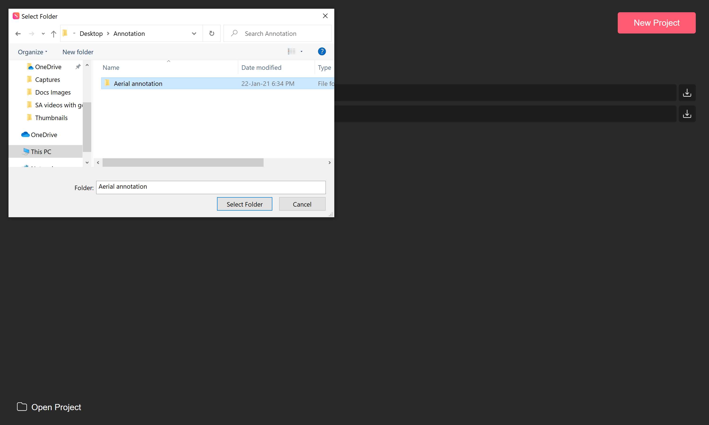
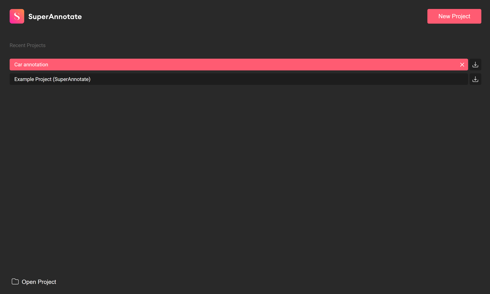
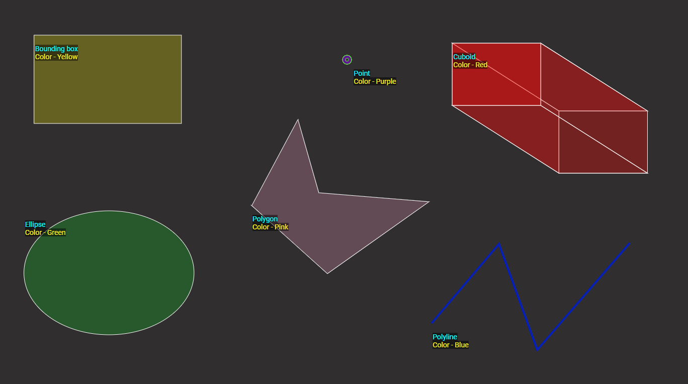

# SuperAnnotate Desktop
## Overview
SuperAnnotate Desktop is the fastest image annotation automation software that allows computer vision engineers to train data fast with top-notch quality and accuracy. It is based on SuperAnnotate’s [web platform](https://app.superannotate.com/login), and is available on Windows, MacOs, and Linux. Download SuperAnnotate Desktop [here](https://superannotate.com/download/).  
## Quickstart
SuperAnnotate Desktop is available on Windows, MacOs, and Linux. Click [here](https://superannotate.com/download/) to download.
## What can I do with SuperAnnotate Desktop?
You can create high-quality training datasets and annotations for computer vision tasks.
## What problem does it solve?
SuperAnnotate Desktop accelerates data training by at least three times, without compromising the annotation quality. 
## Who is it for?
SuperAnnotate Desktop is ideal for individual researchers and small annotation teams that aim to perform simple computer vision tasks. Use SuperAnnotate’s [web platform](https://app.superannotate.com/) to complete complex tasks, manage large teams, and view project analytics.
## How can I upgrade?
SuperAnnotate’s [web platform](https://app.superannotate.com/) allows you to create high-quality annotations for top-performing computer vision models regardless of team and project size. It also allows you to set up projects and distribute tasks automatically, use neural networks to automate the annotation process, and integrate your computer vision pipeline using Python SDK. [Contact us](https://www.superannotate.com/contacts) to upgrade. 
# Project
## Create project

1. Go to the homepage, and select **New project**. 
2. Enter a project name, choose the folder where you want to store your project’s data
3. Import your images. You can either drag and drop your images, or choose them from your files. 
4. When you’re done, select **Create**.
## Open project

You can work on existing projects in SuperAnnotate. Go to the homepage, click **Open project** in the bottom left corner, and select your project from your computer. 
## Export project
To export a project:

1. Go to the homepage and click on the corresponding download icon. 
2. Choose if you want to include images or annotations or both in your download. Note that you cannot download your project if you don’t check at least one box. 
3. When you’re done, select **Export**.
4. Choose the folder name and destination.
5. Select **Export**.

Your JSON files and images will be saved in the same ZIP folder.
## Remove project

To remove a project from the list, go to the homepage, hover over the project you want to remove, and select **X**.

:bulb: Removing a project from the list **does not** delete it from your computer. To open a project that you removed from the list, click **Open project** and select your project from your computer.
# Editor

## Annotations
### Annotate
Use these tools to annotate your projects. Choose the tool depending on the shape of the object you want to annotate.
* Points
* Polyline
* Polygon
* Bounding box
* Ellipse
* Cuboid

:bulb: Use the ruler as a guide while annotating, and zoom in on the object for better annotation results.

:bulb: SuperAnnotate automatically saves your progress.
### Adjust annotation
Press **Esc** to delete the last point you added to your polygon and polyline.
### Delete annotation
**Method 1:** Select the annotation and press the backspace key or **Del** (Windows). 
**Method 2:** Find the annotation in the right panel and click on the corresponding **X** button.
To delete all the annotations from the image you’re working on, select **Revert** (trash icon) in the bottom panel or press **Ctrl+Shift+R** and confirm your action.

:bulb: Select :question: to get access to keyboard shortcuts. 
# Classes
## Create a class
**Method 1:**
1. Select **Add a class** in the right panel. 
2. Enter a name and choose a color.
3. Add an attribute group (optional).
To add an attribute group:
1. Select **New attribute group**.
2. Enter an attribute group name.
3. Enter an attribute and select **+**. You can add multiple attribute groups and attributes.
5. Check **Allow multiple selection** if the attributes can exist within an object simultaneously. When you do that, you’ll be able to assign multiple attributes to an object. For example, if your annotated object is a black and orange car, choose both black and orange from the attribute group. Do not check **Allow multiple selection** if the attributes can’t exist simultaneously. For example, a dog can’t be small and medium at the same time. 
**Method 2:**
1. Right-click on the instance.
2. Open the drop-down menu and select **Create new class**.
3. Enter a name and choose a color.
## Assign class
Use one of these methods to assign a class to an instance:
**Method 1:** Right-click on an instance and choose a class from the drop-down menu.
**Method 2:** Select an instance, find it in the right panel, and choose a class from the drop-down menu.
**Method 3:** Select the **Eyedropper** tool, click on an object to sample its class. The **Eyedropper** tool will change into the **Bucket** tool. Next, select your unassigned object(s). The **Eyedropper** tool facilitates the class assignment of multiple objects.

Alternatively, you can assign a class to your object before annotating it. Follow these steps: 
1. Select the class selection tool in the left panel.
2. Choose a class. 
3. Annotate your object using any tool you want. 

Your instance will be immediately assigned to the class you’ve chosen.
## Change class
You can change a class in two ways:
**Method 1:** Right-click on your object and choose a class from the drop-down menu.
**Method 2:** Select your object, find it in the right panel, select the ellipsis button, and move your object to a different existing class.
# Objects
## Copy objects
You can copy instances as well as their assigned classes and attributes in one image or to other images:
1. Select the instance, and click **Copy** in the top panel, or press **Ctrl+C**.
2. Click **Paste** in the top panel or press **Ctrl+V**.
## Group objects
In some cases, you might need to use more than one tool to annotate a single object. To let the system know that several instances belong together, you need to group them. 
1. Select an instance, and press and hold the **Ctrl** key.
2. While holding the Ctrl key, click on the instances you want to select.
3. Select **Group** in the top panel.
If you think you’ve made a mistake, select **Ungroup** or press **Ctrl+Shift+G** and start over.
## Show/Hide objects
Select the eye button in the top panel or press **R** to show or hide the instances.
# Images
## Upload images
To upload an image, select **Upload** in the bottom panel, and choose **Image**. Next, select images from your computer and click **Open**.
## Delete images
To delete an image, hover over the information icon in the image panel and select the trash icon.
## Set image status
An image can have one of the following statuses:
* Not started
* In progress
* Complete
To set an image as **Complete**, select **Complete** at the bottom of the right panel. Note that you should classify all the instances to be able to set an image as **Complete**.
To see the status of an image, go to the image panel and hover over the icon on the right. 
## Add tags
1. Select **Tags** in the left panel.
2. Enter a tag in the text box.
3. Click the **+** button.
4. Select **Save**.
## Adjust settings
Adjust the settings of your image by dragging the slider to the left or to the right:
* Brightness
* Fill (instance transparency)
* Contrast
## Show labels
Select **Show/Hide labels** in the top panel to see the following labels on your image:
* Classes
* Attributes
* Points 
* Groups
You can also expand an instance in the right panel to see its attributes and point labels.
# Import & Export
## Format
The explanation will be based on this image:

Each image has a corresponding JSON file with the following file name [IMAGE_NAME].json. 
The JSON file contains three main fields:
'''json
{
    "metadata": {},
    "tags": [],
    "instances": []
}
'''
### Metadata
'''json
{
    "version": "1.0.0",
    "name": "Untitled design (1).png",
    "status": "In progress"
}
'''
**Description:**
* “version”: JSON version
* “name”: Image name
* “status”: Image status
### Tags
'''json
[
    "Shapes",
    "Figures"
]
'''
**Description:**
* “Shapes”: Tag name.
* “Figures”: Tag name.
### Instances
#### Bounding box
```json
{
      "type": "bbox",
      "classId": 6,
      "className": "Bounding box",
      "probability": 100,
      "points": {
        "x1": 83.9,
        "x2": 531.7,
        "y1": 81.5,
        "y2": 380.7
      },
      "groupId": 0,
      "pointLabels": {},
      "locked": false,
      "visible": true,
      "attributes": [
        {
          "id": 15,
          "groupId": 5,
          "groupName": "Color",
          "name": "Yellow"
        }
      ]
    }
```
**Description:**
* “type” : The dictionary is a bounding box.
* “classId” : int - Class ID (one of the class IDs in“classes.json”)
* "className" : - Class name
* “probability” : float - Bounding box prediction. If the annotator created the bounding box, then the probability value is 100.
* “points” : list - Points of the bounding box. The list of floats is: "x1, y1" for the left upper corner, and "x2, y2" for the right lower corner.
* “groupId” : int - Group ID of instances
* “pointLabels” : dict - The keys are from “0” to “3” for the 4 vertices of the bounding box.
* “locked” : bool - If it’s true, you won’t be able to move the object on the canvas.
* “visible” : bool - If it’s true, you’ll be able to see the annotations on the canvas.
* “attributes” : list_of_dicts - List of attributes for this bounding box.
	* “id” : int - Attribute ID (must be in “classes.json”)
	* “groupId” : int - Group ID (must be in “classes.json”)
	* "name" : str - Attribute name
	* "groupName" : str - Group name
#### Polygon
```json
{
      "type": "polygon",
      "classId": 6,
      "className":"Polygon",
      "probability": 100,
      "points": [
        908.2999877929687,
        649.7999877929687,
        929.9,
        589.5,
        1278.6,
        565.8,
        992.3,
        994.1,
        727.5,
        929.5,
        964.3,
        856.4,
        794.3,
        632.6
      ],
      "groupId": 0,
      "pointLabels": {},
      "locked": false,
      "visible": true,
      "attributes": [
        {
          "id": 6,
          "groupId": 6,
          "groupName": "Color",
          "name": "Pink"
        }
      ]
    }
```
**Description:**
* “type” : The dictionary is a polygon.
* “classId” : int - Class ID (one of the class IDs in“classes.json”)
* "className" : - Class name
* “probability” : float - Bounding box prediction. If the annotator created the bounding box, then the probability value is 100.
* “points” : list - Points of the bounding box. The list of floats is: "x1, y1" for the left upper corner, and "x2, y2" for the right lower corner.
* “groupId” : int - Group ID of instances
* “pointLabels” : dict - The keys are from “0” to “3” for the 4 vertices of the bounding box.
* “locked” : bool - If it’s true, you won’t be able to move the object on the canvas.
* “visible” : bool - If it’s true, you’ll be able to see the annotations on the canvas.
* “attributes” : list_of_dicts - List of attributes for this bounding box.
	* “id” : int - Attribute ID (must be in “classes.json”)
	* “groupId” : int - Group ID (must be in “classes.json”)
	* "name" : str - Attribute name
	* "groupName" : str - Group name
Point
```json
{
      "type": "point",
      "classId": 11,
      "className": "Point",
      "probability": 100,
      "x": 1612.2,
      "y": 275.2,
      "groupId": 0,
      "pointLabels": {},
      "locked": false,
      "visible": true,
      "attributes": [
        {
          "id": 20,
          "groupId": 12,
          "groupName": "Color",
          "name": "Purple"
        }
      ]
    }
```
**Description**
* “type” : The dictionary is a point.
* “classId” : int - Class ID (one of the class IDs in“classes.json”)
* "className" : - Class name
* “groupId” : int - Group ID of instances
* “locked” : bool - If it’s true, you won’t be able to move the object on the canvas.
* “pointLabels” : dict - The keys are from “0” to “3” for the 4 vertices of the bounding box.
* “points” : list - Points of the bounding box. The list of floats is: "x1, y1" for the left upper corner, and "x2, y2" for the right lower corner.
* “probability” : float - Bounding box prediction. If the annotator created the bounding box, then the probability value is 100.
* “visible” : bool - If it’s true, you’ll be able to see the annotations on the canvas.
* “attributes” : list_of_dicts - List of attributes for this bounding box.
	* “id” : int - Attribute ID (must be in “classes.json”)
	* “groupId” : int - Group ID (must be in “classes.json”)
	* "name" : str - Attribute name
	* "groupName" : str - Group name
#### Polyline
```json
 {
      "type": "polyline",
      "classId": 8,
      "className": "Polyline",
      "probability": 100,
      "points": [
        187.2,
        746.7,
        617.7,
        570.2,
        464.9,
        1050.2,
        309.9,
        989.9
      ],
      "groupId": 0,
      "pointLabels": {},
      "locked": false,
      "visible": true,
      "attributes": [
        {
          "id": 17,
          "groupId": 8,
          "groupName": "Color",
          "name": "Blue"
        }
      ]
    }
```
**Description:**
* “type” : The dictionary is a polyline.
* “classId” : int - Class ID (one of the class IDs in“classes.json”)
* "className" : - Class name
* “probability” : float - Bounding box prediction. If the annotator created the bounding box, then the probability value is 100.
* “points” : list - Points of the bounding box. The list of floats is: "x1, y1" for the left upper corner, and "x2, y2" for the right lower corner.
* “groupId” : int - Group ID of instances
* “pointLabels” : dict - The keys are from “0” to “3” for the 4 vertices of the bounding box.
* “locked” : bool - If it’s true, you won’t be able to move the object on the canvas.
* “visible” : bool - If it’s true, you’ll be able to see the annotations on the canvas.
* “attributes” : list_of_dicts - List of attributes for this bounding box.
	* “id” : int - Attribute ID (must be in “classes.json”)
	* “groupId” : int - Group ID (must be in “classes.json”)
	* "name" : str - Attribute name
	* "groupName" : str - Group name
#### Ellipse
```json
{
      "type": "ellipse",
      "classId": 7,
      "className": "Ellipse",
      "probability": 100,
      "cx": 1041.8,
      "cy": 264.5,
      "rx": 275.5,
      "ry": 213.1,
      "angle": 0,
      "groupId": 0,
      "pointLabels": {},
      "locked": false,
      "visible": true,
      "attributes": [
        {
          "id": 16,
          "groupId": 6,
          "groupName": "Color",
          "name": "Green"
        }
      ]
    }
```    
**Description:**
* “type” : “ellipse” - The dictionary is an ellipse.
* “classId” : int - Class ID (one of the class IDs in the “classes.json”)
* "className" : - Class name
* “probability” : float - Ellipse prediction. If the annotator created the ellipse, then the probability value is 100.
* “cx” - x-coordinate of the center
* “cy” - y-coordinate of the center
* “rx” - x radius
* “ry” - y radius
* "angle” - rotation angle
* “groupId” : int - Group ID of instances
* “pointLabels” : dict - The keys are numbers that range from 0 to 8, and the values are texts.
* “locked” : bool - If it’s true, you won’t be able to move the object on the canvas.
* “visible” : bool - If it’s true, you’ll be able to see the annotations on the canvas.
* “attributes” : list_of_dicts - List of attributes for this polygon.
	* “id” : int - Attribute ID (must be in “classes.json”)
	* “groupId” : int - Group ID (must be in “classes.json”)
	* "name" : str - Attribute name
	* "groupName" : str - Group name
#### Cuboid
```json
{
      "type": "cuboid",
      "classId": 10,
      "className": "Cuboid",
      "probability": 100,
      "points": {
        "f1": {
          "x": 1366.8,
          "y": 585.2
        },
        "f2": {
          "x": 1648.8,
          "y": 865
        },
        "r1": {
          "x": 1558.4,
          "y": 649.8
        },
        "r2": {
          "x": 1853.3,
          "y": 1026.5
        }
      },
      "groupId": 0,
      "pointLabels": {},
      "locked": false,
      "visible": true,
      "attributes": [
        {
          "id": 19,
          "groupId": 11,
          "groupName": "Color",
          "name": "Red"
        }
      ]
    }
 ```
**Description:**
* “type” : “cuboid” - The dictionary is a cuboid.
* “classId” : int - Class ID (one of the class IDs in “classes.json”)
* "className" : - Class name
* “probability” : float - Cuboid prediction. If the annotator created the cuboid, then the probability value is 100.
* “points”: - “f1” and “f2” are front box points with “x” and “y” coordinates, and “r1” and “r2” are rear box points with “x” and “y” coordinates.
* “groupId” : int - Group ID of instances
* “pointLabels” : dict - The keys are numbers that range from 0 to 8, and the values are texts.
* “locked” : bool - If it’s true, you won’t be able to move the object on the canvas.
* “visible” : bool - If it’s true, you’ll be able to see the annotations on the canvas.
* “attributes” : list_of_dicts - List of attributes for this cuboid.
	* “id” : int - Attribute ID (must be in “classes.json”)
	* “groupId” : int - Group ID (must be in “classes.json”)
	* "name" : str - Attribute name
	* "groupName" : str - Group name
#### Class
```json
 {
    "attribute_groups": [
      {
        "id": 5,
        "name": "Color",
        "is_multiselect": false,
        "attributes": [
          {
            "id": 15,
            "name": "Yellow"
          }
        ],
        "opened": true,
        "hasChanges": true
      }
    ],
    "color": "#fffb00",
    "id": 6,
    "name": "Bounding box",
    "opened": true
  }
```  
**Description:**
* “attribute_groups”: - List of all the attributes.
	* “id”: - Group ID
	* “name”: - Attribute name
	* “is_multiselect”: - It’s either true or false. It’s true if you can select multiple attributes, and it’s false if you can choose only one attribute.
	* “attributes” - List of attribute values.
		* “id”: - Attribute ID.
		* “name”: - Attribute name.
* “color”: - Class color.
* “Id”: Class ID.
* “Name”: Class name.
## Import
### Images
Import images when creating a project or add them later.
### Annotations
To import existing annotations to your project, select **Upload** in the bottom panel and choose **Annotation**. Next, choose a JSON file from your computer, and select **Open**.

:bulb: You can import annotations from previous or current desktop app versions.

:bulb: Note that you can only upload SuperAnnotate format files, and that the uploaded annotations will overwrite your current annotations. 
### Classes
To import classes, select **Add a class** in the right panel and select Upload JSON. Next, choose a JSON file from your computer, and select **Open**.
## Export
### Project 

1. Go to the homepage and click on the corresponding download icon. 
2. Choose if you want to include images or annotations or both in your download. Note that you cannot download your project if you don’t check at least one box. 
3. When you’re done, select **Export**.
4. Choose the folder name and destination.
5. Select **Export**.

Your JSON files and images will be saved in the same ZIP folder. 
